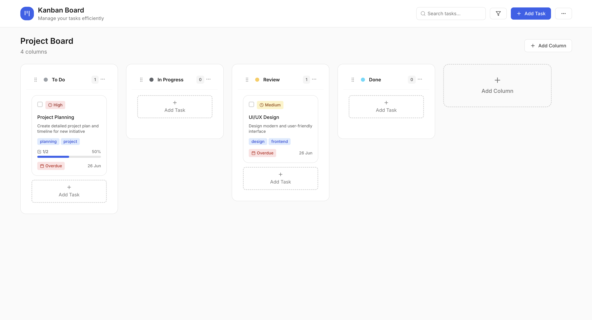
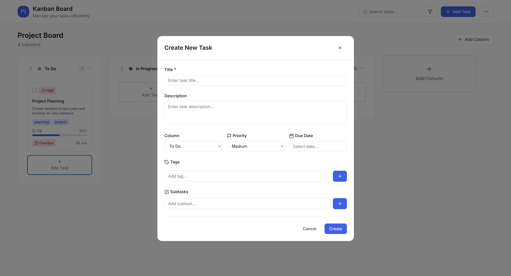
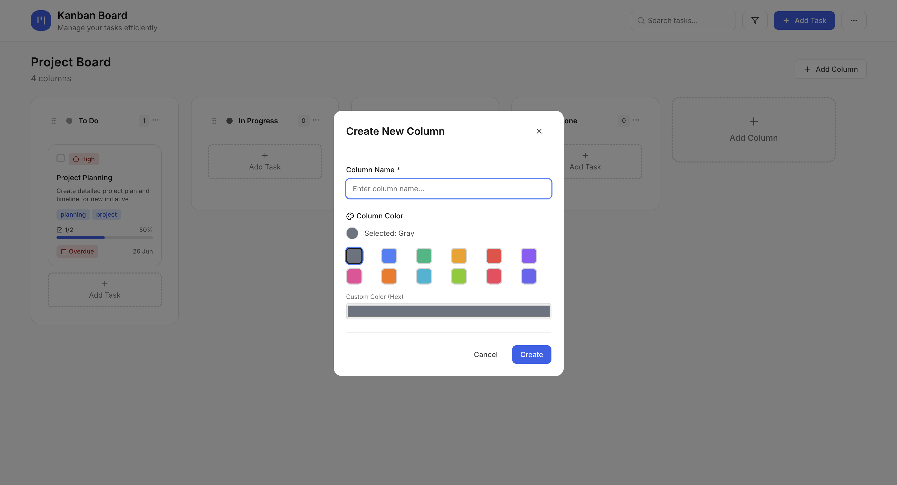
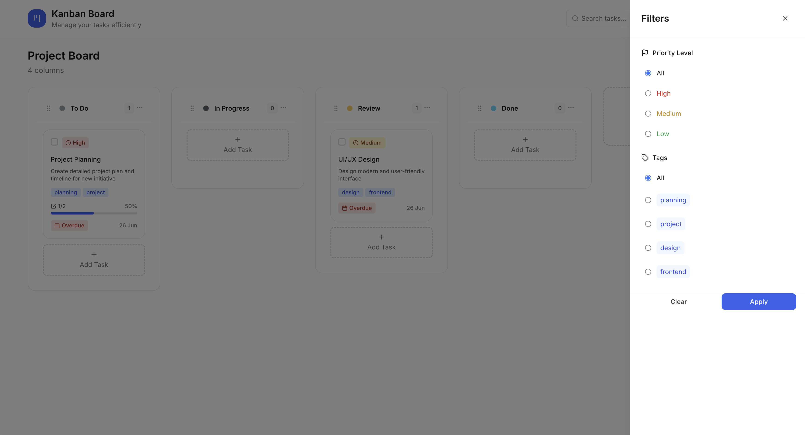

# 📋 Kanban Task Manager

A modern and user-friendly **Kanban Board** task management application built with React 18 and modern technologies.

## 🚀 Live Demo

[**View Demo →**](https://berkesasa.github.io/React-taskmanager/)

## ✨ Features

### 🎯 Core Features
- **Drag & Drop**: Easy task movement with drag and drop functionality
- **Kanban Board**: Visual project management with classic Kanban methodology
- **Responsive Design**: Perfect appearance on all devices
- **Real-time Updates**: Instant updates and changes
- **Local Storage**: Your data is safely stored in the browser

### 📊 Task Management
- **Task Creation**: Create tasks with detailed information
- **Priority Levels**: Low, Medium, High priority levels
- **Due Dates**: Set deadlines with date picker
- **Tags**: Colorful tags for categorization
- **Subtasks**: Break down main tasks into smaller parts
- **Progress Tracking**: Progress bar for subtasks

### 🔧 Advanced Features
- **Search**: Quickly find your tasks
- **Filtering**: Filter by tags and priority levels
- **Bulk Operations**: Manage multiple tasks simultaneously
- **Data Import/Export**: Backup in JSON format
- **Column Management**: Add/edit custom status columns
- **Dark Mode Compatible**: Modern minimal design

## 📸 Screenshots

### Main Kanban Board


### Task Management Modal



### Filters


## 🛠️ Technologies

### Frontend
- **React 18** - Modern React framework
- **Vite** - Fast build tool and dev server
- **TailwindCSS** - Utility-first CSS framework
- **Zustand** - Lightweight state management
- **React Beautiful DND** - Drag & drop functionality

### Form & Validation
- **React Hook Form** - Performant form management
- **React DatePicker** - Advanced date selection

### UI & UX
- **Lucide React** - Modern icon set
- **React Hot Toast** - Elegant notification system
- **Date-fns** - Date formatting

### Utilities
- **NanoID** - Unique ID generation
- **ESLint** - Code quality

## 🚀 Installation

### Requirements
- Node.js (v16 or higher)
- npm or yarn

### Steps

1. **Clone the repository**
```bash
git clone https://github.com/berkesasa/React-taskmanager.git
cd React-taskmanager
```

2. **Install dependencies**
```bash
npm install
# or
yarn install
```

3. **Start development server**
```bash
npm run dev
# or
yarn dev
```

4. **Open in browser**
```
http://localhost:3000
```

## 📦 Build & Deploy

### Production Build
```bash
npm run build
```

### Preview Build
```bash
npm run preview
```

### GitHub Pages Deploy
The project is automatically deployed with GitHub Actions. The `.github/workflows/deploy.yml` file manages the deployment pipeline.

## 📁 Project Structure

```
src/
├── components/          # React components
│   ├── Header.jsx      # Main header component
│   ├── KanbanBoard.jsx # Kanban board container
│   ├── KanbanColumn.jsx # Single column component
│   ├── TaskCard.jsx    # Task card component
│   ├── TaskModal.jsx   # Task add/edit modal
│   ├── FilterPanel.jsx # Filtering panel
│   ├── BulkActionBar.jsx # Bulk operations
│   └── ...
├── store/              # State management
│   └── kanbanStore.js  # Zustand store
├── App.jsx            # Main application
├── main.jsx           # React DOM render
└── index.css          # Global styles
```

## 🎨 Customization

### Color Theme
You can customize the color palette from the `tailwind.config.js` file:

```javascript
module.exports = {
  theme: {
    extend: {
      colors: {
        primary: {
          50: '#eff6ff',
          500: '#3b82f6',
          600: '#2563eb',
        }
      }
    }
  }
}
```

### Default Columns
You can change the initial columns from `src/store/kanbanStore.js` file.

## 💡 Usage

1. **Create Tasks**: Click the "Add Task" button to add new tasks
2. **Move Tasks**: Drag tasks to different columns
3. **Filter**: Use the filter button in the top panel to categorize tasks
4. **Bulk Operations**: Select checkboxes to manage multiple tasks simultaneously
5. **Data Backup**: Use "Export Data" from the menu to backup your data

## 📄 License

This project is licensed under the MIT License. See the `LICENSE` file for details.

